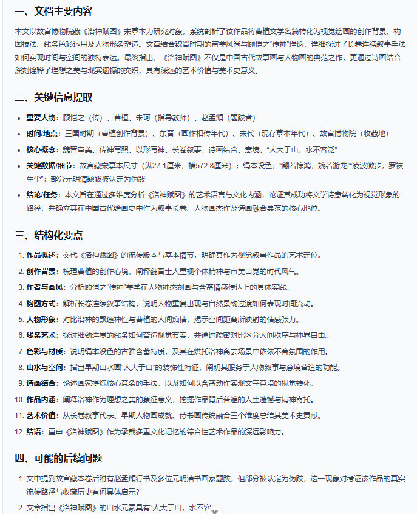
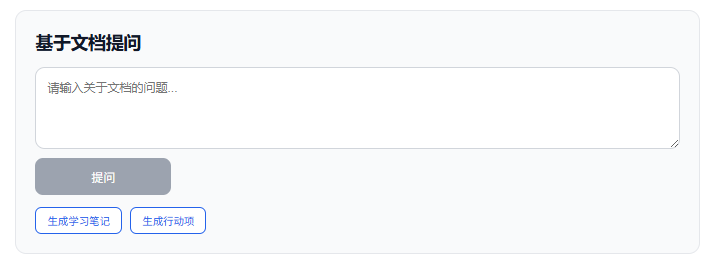

# DocFlow Agent

DocFlow Agent 是一个基于 **FastAPI + Vue 3 + OpenAI-compatible LLM API** 构建的 AI 文档解析与 RAG 问答系统原型。

项目面向学习资料、课程论文、实验报告、项目文档等场景，支持文档上传解析、结构化摘要生成、流式摘要输出、扫描型 PDF OCR 识别、基础 RAG 检索、文档问答、参考片段展示、学习笔记生成、行动项提取、Markdown 报告导出、数据库状态管理、结构化日志、pytest smoke tests、Docker Compose 本地一键启动，以及前端文档工作台展示。

当前版本：**v0.6.0**

> 当前项目定位为个人学习与作品集展示项目，重点实践 AI 应用开发中的文档解析、OCR、大模型调用、流式输出、基础 RAG、数据库状态管理、统一异常处理、结构化日志、后端测试、Docker 本地部署和前端产品化展示等工程流程，不等同于生产级企业文档平台。

---

## 一、项目简介

DocFlow Agent 的核心目标是将常见文档处理流程自动化，并通过前端工作台展示文档处理状态和问答结果：

```text
上传文档
↓
解析文本内容
↓
必要时进行 OCR 识别
↓
保存文档元数据与处理状态
↓
文档分块 chunk
↓
生成基础 embedding
↓
保存本地向量索引
↓
用户基于文档提问
↓
top-k 检索相关片段
↓
调用大模型生成回答
↓
写入问答记录
↓
前端展示文档列表、当前文档、摘要、回答和参考片段
```

当前项目已实现从“普通聊天 Demo”到“AI 文档解析与 RAG 问答系统原型”的基础升级。

前端支持单文档上传、摘要、问答、参考片段展示、学习笔记生成、行动项提取、复制、Markdown 报告导出、文档列表展示、当前文档详情展示、后端健康状态和 OCR 状态展示。

后端支持文档解析、OCR 回退识别、文本分块、基础 RAG 检索、LLM 调用、Excel 分析、多文档对比、本地记忆、数据库持久化、文档状态管理、统一异常处理、结构化日志、pytest smoke tests 和 Docker Compose 本地容器化启动。

---

## 二、当前已实现功能

### 1. 文档上传与结构化摘要

用户可以上传 TXT / PDF 文档，系统会自动解析文档内容，并调用大模型生成结构化摘要。

摘要内容包括：

1. 文档主要内容
2. 关键信息提取
3. 结构化要点
4. 可能的后续问题

当前支持两种摘要模式：

| 模式 | 说明 |
|---|---|
| 快速摘要 | 输入较短上下文，生成速度更快，适合快速预览 |
| 深度摘要 | 输入更多文档内容，生成更完整的结构化摘要，适合论文、报告和较长文档 |

当前运行链路：

```text
上传 TXT / PDF 文档
↓
backend/main.py 接收 /api/documents/summarize/stream 请求
↓
backend/document_parser.py 解析文档文本
↓
如果是扫描型 PDF 且普通文本提取过少，自动调用 OCR 回退识别
↓
写入 documents 表并更新文档状态
↓
backend/llm_client.py::summarize_text_stream() 构造摘要 prompt
↓
调用阿里云百炼 qwen 模型
↓
前端边生成边显示结构化摘要
↓
刷新文档列表并同步当前文档
```

---

### 2. 流式摘要输出

项目支持流式摘要能力。后端通过：

```text
POST /api/documents/summarize/stream
```

返回 `application/x-ndjson` 流式事件，前端使用 `response.body.getReader()` 逐段读取模型输出，实现“边生成边显示”的摘要体验。

流式事件包括：

| 事件类型 | 说明 |
|---|---|
| `status` | 当前处理状态，例如正在解析文档、正在生成摘要 |
| `meta` | 文件名、文件类型、字符数、是否截断、预览文本、doc_id 等元数据 |
| `delta` | 模型新增生成的文本片段 |
| `done` | 摘要生成完成 |
| `error` | 错误信息 |

旧版非流式接口 `POST /api/documents/summarize` 仍然保留。

---

### 3. 扫描型 PDF OCR 支持

项目支持扫描型 PDF 的自动识别。

当 PDF 无法直接提取文字，或普通文本提取结果少于 `OCR_MIN_TEXT_LENGTH` 时，系统会自动回退到 Tesseract OCR，对扫描型 PDF 页面进行文字识别，然后继续进入摘要和问答流程。

OCR 处理链路：

```text
上传 PDF
↓
pypdf 尝试提取文本
↓
如果提取文本过少
↓
backend/ocr_parser.py 调用 Tesseract OCR
↓
识别页面图片中的文字
↓
返回给 document_parser.py
↓
进入 LLM 摘要 / 问答流程
```

本地运行时需要安装 Tesseract-OCR，并在环境变量中配置路径。Docker 运行时后端镜像会预装 Tesseract OCR 和中英文语言包。

---

### 4. 基础 RAG 文档问答

用户上传文档后，可以围绕当前文档进行提问。系统会优先使用基础 RAG 检索相关片段，再调用大模型生成回答。

当前 RAG 问答链路：

```text
用户上传文档
↓
解析文本
↓
chunk_text() 切分文档片段
↓
embedding_service.py 生成 256 维 hash embedding
↓
vector_store.py 保存到 storage/vector_index/{doc_id}.json
↓
用户提问
↓
问题向量化
↓
向量相似度 top-k 检索相关 chunk
↓
拼接上下文
↓
ask_llm() 调用大模型生成回答
↓
返回 answer 和 related_chunks
↓
写入 qa_records 表
```

当前问答接口返回结构包含：

```json
{
  "doc_id": "文档 ID",
  "filename": "文件名",
  "question": "用户原始问题",
  "answer": "模型回答",
  "related_chunks": [
    {
      "chunk_id": 0,
      "text": "相关片段",
      "score": 0.83,
      "retrieval_method": "embedding"
    }
  ],
  "report_path": "Markdown 报告路径"
}
```

如果向量索引缺失、读取失败或向量检索异常，系统会自动回退到原关键词检索，并在 `related_chunks` 中标记：

```json
{
  "retrieval_method": "fallback_keyword"
}
```

当前 RAG 是轻量本地实现，重点是跑通工程链路。它不等同于生产级语义检索系统，后续可以替换为真实 embedding 模型和向量数据库。

---

### 5. 前端文档工作台

项目新增前端文档工作台展示能力，不再只停留在“上传 PDF 并显示摘要”的单一页面。

当前前端工作台包含：

| 区域 | 说明 |
|---|---|
| 系统状态栏 | 显示 Backend 健康状态和 OCR 可用状态 |
| 文档列表 | 展示已上传文档的文件名、类型、状态、解析方式、字符数 |
| 当前文档详情 | 点击文档后展示当前文档的 doc_id、状态、解析方式、字符数等信息 |
| 摘要区域 | 展示当前上传或生成的结构化摘要 |
| 文档问答区 | 围绕当前文档提问 |
| RAG 参考片段展示 | 展示 `related_chunks`、`chunk_id`、`retrieval_method` 和 `score` |
| 快捷分析 | 支持生成学习笔记和行动项 |

状态标签规则：

| 状态 | 颜色 |
|---|---|
| `ready` | 绿色 |
| `parsing` / `parsed` / `summarizing` | 蓝色 |
| `uploaded` | 灰色 |
| `failed` | 红色 |
| unknown | 灰色 |

系统状态显示规则：

| 状态项 | 说明 |
|---|---|
| Backend OK | 后端健康检查成功 |
| Backend Error | 后端健康检查失败 |
| OCR Available | OCR 服务可用 |
| OCR Unavailable | OCR 服务不可用或请求失败 |

前端会在页面加载时获取系统状态和文档列表，并在上传、摘要生成后刷新文档列表，尽量同步当前选中文档。

---

### 6. 文档状态管理

项目引入文档状态字段，用于追踪文档从上传、解析、摘要到可问答的处理过程。

状态流转：

```text
uploaded → parsing → parsed → summarizing → ready
              │                    │
              └──────→ failed      └──────→ failed
```

状态说明：

| 状态 | 说明 |
|---|---|
| `uploaded` | 文件已上传并保存 |
| `parsing` | 正在解析文本或进行 OCR |
| `parsed` | 文本解析完成，chunk 索引已建立 |
| `summarizing` | 正在调用大模型生成摘要 |
| `ready` | 摘要或处理完成，可用于问答 |
| `failed` | 处理失败，错误信息写入 `error_message` |

状态查询接口：

```text
GET /documents/{doc_id}/status
```

---

### 7. 数据库持久化

项目引入 SQLAlchemy 管理文档元数据、处理状态和问答记录，默认使用 SQLite。

当前数据库表：

| 表名 | 说明 |
|---|---|
| `documents` | 保存文档 ID、文件名、类型、解析方式、字符数、状态、错误信息等元数据 |
| `qa_records` | 保存文档问答记录，包括问题、回答和创建时间 |

当前采用兼容迁移策略：

1. 数据库保存文档元数据、处理状态和问答记录。
2. 原始上传文件、chunk、本地索引和向量索引仍保留在本地文件系统。
3. 旧 JSON 文件索引保留可读。
4. 新上传文档写入数据库。
5. 后续可继续迁移 chunk、索引和向量数据到数据库或专用向量存储。

---

### 8. 学习笔记与行动项生成

前端提供两个快捷分析按钮：

| 功能 | 说明 |
|---|---|
| 生成学习笔记 | 基于当前文档生成适合学生复习的学习笔记，包括核心概念、重点知识、易混点和复习建议 |
| 生成行动项 | 从当前文档中提取任务、待办事项、后续问题或改进建议 |

这两个功能复用已有 `/ask` 文档问答接口，不额外引入新的后端接口。

---

### 9. 复制与 Markdown 报告导出

前端支持：

- 复制摘要
- 复制回答
- 导出 Markdown 分析报告

导出的 Markdown 报告包含：

- 文件名
- 文件类型
- 字符数
- 摘要模式
- 是否截断
- 结构化摘要
- 问答历史
- 每个问答的参考片段
- 生成时间

---

### 10. Excel 分析与图表生成

上传 Excel 文件后，后端可以分析表格结构、统计数值字段，并生成柱状图 / 折线图。

相关模块：

```text
backend/table_analyzer.py
backend/chart_generator.py
```

当前该能力主要在后端接口层实现，前端页面仍以 TXT / PDF 文档摘要和问答为主。

---

### 11. 本地记忆与报告保存

项目包含简单的本地记忆系统和 Markdown 报告保存能力：

| 模块 | 说明 |
|---|---|
| `backend/memory.py` | 保存用户偏好和历史记录 |
| `backend/report.py` | 保存问答报告为 Markdown 文件 |

---

## 三、技术栈

### 后端

| 模块 | 技术 / 文件 | 说明 |
|---|---|---|
| Web 框架 | FastAPI | 后端 API 服务 |
| ASGI 服务 | Uvicorn | 本地开发服务 |
| LLM SDK | openai | 使用 OpenAI-compatible API 调用模型 |
| 模型服务 | 阿里云百炼 DashScope | 当前示例使用 qwen 模型 |
| PDF 解析 | pypdf | 提取普通 PDF 文本 |
| 扫描 PDF OCR | Tesseract + pytesseract + PyMuPDF + Pillow | OCR 回退识别 |
| Word 解析 | python-docx | 解析 `.docx` |
| Excel 解析 | pandas + openpyxl | 表格读取与统计 |
| 图表生成 | matplotlib | 生成柱状图 / 折线图 |
| 文本切分 | 自定义 chunker | 将长文档切分为可检索片段 |
| 基础 Embedding | hash embedding | 基于字符 n-gram 的轻量向量化方案 |
| 向量索引 | 本地 JSON vector index | 保存 chunk embedding，支持 top-k 检索 |
| ORM | SQLAlchemy | 管理文档元数据、文档状态和问答记录 |
| 数据库迁移 | Alembic | 管理数据库表结构迁移 |
| 默认数据库 | SQLite | 本地零配置数据库 |
| 测试框架 | pytest | 后端 smoke tests |
| 日志系统 | Python logging + JSON formatter | 结构化日志记录 |
| 异常处理 | FastAPI exception_handler | 统一处理业务异常、HTTP 异常和未捕获异常 |
| 容器化 | Docker / docker-compose | 封装后端、前端、OCR 环境和持久化目录 |
| 环境变量 | python-dotenv | 读取 `.env` 配置 |

---

### 前端

| 技术 | 说明 |
|---|---|
| Vue 3 | 前端框架 |
| Vite | 前端构建工具 |
| JavaScript | 前端开发语言 |
| markdown-it | 渲染模型返回的 Markdown |
| Fetch API | 调用后端接口 |
| ReadableStream | 实现流式摘要显示 |
| Nginx | Docker 环境下托管前端静态资源 |

当前前端主要使用 `DocumentPanel.vue` 展示文档上传、结构化摘要、文档列表、当前文档详情、文档问答、参考片段、复制和导出功能。`ChatPanel.vue` 为历史遗留或后续扩展组件，当前未作为主页面入口。

---

## 四、工程架构

### 1. 统一异常处理体系

项目建立了一套以 `AppException` 为基类的业务异常继承体系，并通过全局单一的 `exception_handler` 将所有异常转换为统一的 `ApiResponse` 响应。

#### 设计目标

1. 所有业务异常返回结构一致，前端可精确区分错误类型。
2. 新增异常类型无需修改核心处理逻辑，符合开闭原则。
3. 未捕获异常不会被直接抛出给客户端，始终返回安全的错误信息。
4. 错误响应中携带 `request_id`，便于根据一次请求定位对应日志。

#### 异常继承树（简化）

```text
AppException (基类，code 分区)
├── 1001 FileTypeNotSupportedError
├── 1002 FileParseError
├── 1003 DocumentNotFoundError
├── 2001 OCRException
└── 3001 LLMException
```

#### 错误码分区规则

| 区间 | 模块 | 示例 |
|---|---|---|
| 1000-1999 | 文档处理 | 文件类型不支持、解析失败、文档未找到 |
| 2000-2999 | OCR 识别 | OCR 环境不可用、识别超时 |
| 3000-3999 | LLM 调用 | 模型请求失败、上下文过长 |
| 5000+ | 系统兜底 | 未捕获异常、内部错误 |

#### 全局异常处理流程

```text
用户请求
  ↓
API 层执行业务逻辑
  ↓ 发生异常
global_exception_handler(Exception) 捕获
  ↓ isinstance 判断
  │
  ├── AppException
  │     ↓
  │   根据 code 和 message 构造 ApiResponse
  │
  ├── HTTPException
  │     ↓
  │   转换为 ApiResponse
  │
  └── 其他未捕获异常
        ↓
      记录完整 traceback
        ↓
      返回通用错误码 5000
  ↓
返回统一响应 { code, message, data, request_id }
```

---

### 2. 结构化日志系统

项目新增结构化日志系统，采用 JSON 行格式记录关键事件，便于后续接入日志检索和问题排查工具。

#### 设计目标

1. 日志机器可读，可直接接入 ELK / Loki 等日志收集系统。
2. 支持按操作类型、文档 ID、用户 ID、错误类型等维度快速检索。
3. 每条日志自动关联 `request_id`，实现全链路追踪。
4. 通过统一 `log_event()` 函数减少散乱的 `print()` 和非结构化日志。

#### 日志字段规范

每条日志固定包含以下字段，缺省值填充为 `null`：

| 字段 | 类型 | 说明 |
|---|---|---|
| `timestamp` | string | ISO 8601 时间戳 |
| `level` | string | INFO / WARNING / ERROR |
| `module` | string | 产生日志的模块名称 |
| `operation` | string | 操作类型：upload / parse / ocr / llm / query / embedding / retrieve 等 |
| `request_id` | string | 本次请求的唯一标识，贯穿整个调用链 |
| `duration_ms` | number / null | 操作耗时，单位毫秒 |
| `user_id` | string / null | 用户 ID，当前预留 |
| `file_id` | string / null | 关联的文件 ID |
| `error_detail` | string / null | 错误详细信息 |

#### 关键路径日志覆盖

| 操作 | 记录点 |
|---|---|
| 文档上传 | 开始 / 完成 / 失败 |
| PDF 解析 | 解析方式选择、起止、耗时 |
| OCR 识别 | 触发原因、页数、DPI、语言、耗时 |
| Embedding | 向量生成开始 / 完成 / 失败 |
| 向量索引 | 保存成功 / 加载失败 / fallback |
| RAG 检索 | 检索开始 / 完成 / 回退关键词检索 |
| LLM 调用 | 请求开始 / 响应完成 / 失败，prompt 预览长度，耗时 |
| 文档问答 | 请求 doc_id、问题长度、检索片段数、回答耗时 |
| 数据库写入 | 文档记录创建、状态更新、问答记录保存 |

---

### 3. 请求全链路追踪（request_id）

为保证一次请求在日志、异常响应中能被完整串联，系统在所有入口自动注入 `request_id`，并使其在业务逻辑中透明传递。

#### 透传机制

```text
中间件 request_context_middleware
  ↓
生成 UUID → 写入 ContextVar
  ↓
业务逻辑任意深处调用 log_event()
  ↓
日志格式化器自动从 ContextVar 读取 request_id
  ↓
异常 handler 同样从 ContextVar 取出 request_id 写入 ApiResponse
```

#### 设计优势

1. 业务代码无需显式传递 `request_id` 参数，保持函数签名干净。
2. 即使发生未捕获异常，错误响应中仍包含 `request_id`，便于定位日志。
3. 同一次上传、解析、OCR、embedding、RAG 检索、LLM 调用、问答保存流程可以通过同一个 `request_id` 串联。
4. 后续如果接入前端错误提示或日志平台，可以直接通过 `request_id` 查找完整调用链。

---

### 4. 数据库持久化与文档状态管理

项目引入 SQLAlchemy 管理文档元数据、处理状态和问答记录，默认使用 SQLite，可通过 `DATABASE_URL` 或 `DOCFLOW_DATABASE_URL` 配置数据库连接。

#### 数据库表结构

| 表名 | 说明 |
|---|---|
| `documents` | 文档元数据、状态、解析方式、字符数和错误信息 |
| `qa_records` | 文档问答记录 |

#### documents 表核心字段

| 字段 | 说明 |
|---|---|
| `id` | 文档 ID，对应 doc_id |
| `filename` | 原始文件名 |
| `file_type` | 文件类型 |
| `storage_path` | 本地存储路径 |
| `parse_method` | 解析方式，如 text、ocr、excel |
| `char_count` | 解析出的字符数 |
| `status` | 文档处理状态 |
| `error_message` | 失败原因 |
| `created_at` | 创建时间 |
| `updated_at` | 更新时间 |

#### qa_records 表核心字段

| 字段 | 说明 |
|---|---|
| `id` | 自增主键 |
| `document_id` | 关联文档 ID |
| `question` | 用户问题 |
| `answer` | 模型回答 |
| `created_at` | 创建时间 |

#### 文档状态流转

```text
uploaded → parsing → parsed → summarizing → ready
              │                    │
              └──────→ failed      └──────→ failed
```

#### 兼容策略

1. 旧有 JSON 文件索引保留可读。
2. `GET /documents` 同时兼容数据库记录和旧 JSON 文件。
3. 当前阶段仅将文档元数据、处理状态和问答记录迁入数据库。
4. 文档 chunk、索引、向量索引和上传文件仍保留在本地文件系统。
5. 后续可继续升级为数据库索引或专用向量检索存储。

#### 为什么默认使用 SQLite

当前项目面向本地开发、学习和作品集展示，SQLite 无需额外安装服务，适合保持“一键启动”的体验。若后续需要多用户和并发部署，可通过修改数据库连接配置迁移到 PostgreSQL 或 MySQL。

---

### 5. 基础 RAG 检索架构

项目将原有关键词检索升级为基础 RAG 检索流程。

#### 上传阶段

```text
上传文档
↓
解析文本
↓
chunk_text() 文档分块
↓
embed_texts() 生成 chunk embedding
↓
save_vectors() 保存本地向量索引
```

向量索引保存路径：

```text
storage/vector_index/{doc_id}.json
```

索引结构示例：

```json
{
  "doc_id": "example-doc-id",
  "chunks": [
    {
      "chunk_id": 0,
      "text": "文档片段内容",
      "embedding": [0.1, -0.2, 0.03]
    }
  ]
}
```

#### 问答阶段

```text
用户问题
↓
问题向量化
↓
读取当前 doc_id 对应向量索引
↓
计算 query embedding 与 chunk embedding 的相似度
↓
选取 top-k 相关片段
↓
构造上下文
↓
调用 LLM 生成回答
↓
返回 answer 和 related_chunks
```

#### fallback 机制

如果以下任一情况发生：

1. 向量索引文件不存在
2. 向量索引读取失败
3. embedding 生成异常
4. 相似度检索结果为空
5. 向量检索出现其他异常

系统会自动回退到原关键词检索：

```text
RAG 检索失败
↓
fallback_keyword
↓
关键词检索相关 chunk
↓
继续调用 LLM 回答
```

这样可以避免因为向量索引问题导致 `/ask` 整个接口不可用。

#### 当前设计边界

当前 embedding 为轻量 hash embedding，主要用于跑通 RAG 工程流程，不能等同于真实语义 embedding。后续可以替换为：

- 本地 ONNX embedding 模型
- sentence-transformers
- OpenAI-compatible embedding API
- Chroma / FAISS / Milvus / pgvector 等向量存储

---

### 6. 前端文档工作台架构

项目新增前端文档工作台，用于把后端文档状态、RAG 检索和 OCR 能力可视化。

#### 页面加载流程

```text
进入页面
↓
onMounted()
↓
并行或依次请求系统状态
  ├── GET /health
  └── GET /ocr/status
↓
请求文档列表
  └── GET /documents
↓
展示文档列表与系统状态
```

#### 文档选择流程

```text
点击文档列表中的某一行
↓
设置当前选中文档 doc_id
↓
请求 GET /documents/{doc_id}/status
↓
展示当前文档详情
```

#### 摘要生成后的同步流程

```text
上传并生成摘要成功
↓
后端返回 doc_id、filename、char_count 等信息
↓
前端刷新文档列表
↓
根据返回 doc_id 同步当前选中文档
↓
更新当前文档详情
```

#### 问答展示增强

问答结果下方展示 `related_chunks`：

| 字段 | 说明 |
|---|---|
| `chunk_id` | 文档片段编号 |
| `text` | 参考片段文本，前端截取前 100 字展示 |
| `retrieval_method` | 检索方式，如 embedding、fallback_keyword、keyword、unknown |
| `score` | 检索得分，缺失时显示 `-` |

#### 当前设计边界

1. 当前前端能恢复历史文档列表和文档状态。
2. 当前前端暂未完整恢复历史摘要内容。
3. 当前前端暂未通过接口恢复历史问答记录。
4. 当前问答历史主要保存在当前页面会话状态中，刷新页面后不会完整保留。
5. 后续可新增问答历史查询接口和摘要结果持久化能力。

---

### 7. pytest Smoke Tests

项目新增后端 smoke tests，用于验证核心 API、数据库写入和 RAG 主链路，避免后续数据库、RAG、状态管理等改造时破坏主流程。

当前测试覆盖：

| 测试用例 | 覆盖内容 |
|---|---|
| `test_health_check` | 健康检查接口 |
| `test_upload_txt_creates_document_record` | TXT 上传、`documents` 表写入、文档列表返回 |
| `test_document_status_after_upload` | 文档状态查询，验证 `status=parsed`、`parse_method=text` |
| `test_ask_writes_qa_record` | 文档问答、`question/answer` 返回结构、`qa_records` 写入 |
| `test_invalid_file_type_returns_error` | 非法文件类型错误响应，避免未捕获 traceback |
| `test_upload_creates_vector_index` | 上传 TXT 后生成本地向量索引 |
| `test_ask_uses_rag_retrieval` | `/ask` 返回带 `retrieval_method` 的相关片段 |
| `test_rag_fallback_when_vector_missing` | 向量索引缺失时自动回退关键词检索 |

测试设计：

1. 使用 `DOCFLOW_DATABASE_URL` 指向临时 SQLite 数据库，避免污染真实 `storage/docflow.db`。
2. 使用 `tmp_path` 和 monkeypatch 隔离上传目录、索引目录、向量目录和输出目录。
3. 使用 monkeypatch mock `backend.main.ask_llm`、`summarize_text`、`summarize_text_stream`，避免测试依赖真实 LLM API。
4. 每个测试前后重建数据库表，保证测试之间相互独立。

运行方式：

```powershell
python -m pytest -q tests/
```

当前边界：

1. 暂未覆盖 PDF、DOCX、Excel 等文件解析。
2. 暂未覆盖流式摘要接口。
3. 暂未覆盖多文档对比和 Excel 分析接口。
4. 当前测试重点是后端主链路 smoke test，不追求完整单元测试覆盖率。

---

### 8. Docker Compose 本地部署

项目支持 Docker / docker-compose 本地一键启动，用于降低项目复现成本。

#### 容器结构

| 服务 | 说明 |
|---|---|
| `backend` | FastAPI 后端服务，负责文档解析、OCR、RAG 检索、LLM 调用和数据库访问 |
| `frontend` | Vue 3 前端静态页面，构建后由 Nginx 托管 |

#### 后端容器启动流程

```text
构建 Python 镜像
↓
安装 Tesseract OCR 与系统依赖
↓
安装 backend/requirements.txt
↓
执行 alembic upgrade head
↓
启动 uvicorn backend.main:app
```

#### 前端容器启动流程

```text
使用 Node 镜像安装依赖
↓
执行 npm run build
↓
使用 Nginx 托管 dist 静态文件
↓
映射到宿主机 5173 端口
```

#### 数据持久化

Docker Compose 将以下目录挂载到宿主机：

| 目录 | 说明 |
|---|---|
| `storage/` | 保存上传文件、SQLite 数据库、chunk 索引和向量索引 |
| `logs/` | 保存后端结构化日志 |

这样即使容器删除，本地数据和日志也不会丢失。

#### 当前定位

当前 Docker 配置主要用于本地一键演示和环境复现，不是完整生产部署方案。生产环境仍建议使用 PostgreSQL / MySQL、对象存储、HTTPS、反向代理、日志收集和更严格的密钥管理。

---

### 9. 后续工程化计划

后续工程化方向包括：

1. 将当前 hash embedding 替换为真实语义 embedding。
2. 将本地 JSON 向量索引升级为 Chroma、FAISS、pgvector 或其他向量存储。
3. 增加摘要接口和流式摘要接口的测试。
4. 增加历史问答记录查询与前端展示。
5. 增加摘要结果持久化与历史摘要恢复。
6. 根据项目规模决定是否引入 Celery / Redis 处理长耗时异步任务。
7. 后续如有多用户需求，再引入用户系统和 JWT 鉴权。

---

## 五、项目结构

```text
docflow-agent/
├── backend/
│   ├── Dockerfile              # 后端 Docker 镜像构建文件
│   ├── main.py                  # FastAPI 主应用，当前后端主入口
│   ├── document_parser.py       # 文档解析，支持 TXT/PDF/DOCX/MD/Excel
│   ├── ocr_parser.py            # Tesseract OCR 识别扫描型 PDF
│   ├── llm_client.py            # LLM 调用，包含 ask_llm / summarize_text / summarize_text_stream
│   ├── chunker.py               # 长文本切分
│   ├── retriever.py             # 关键词检索 + 基础 RAG 检索
│   ├── embedding_service.py     # 轻量 hash embedding
│   ├── vector_store.py          # 本地 JSON 向量索引保存、读取与检索
│   ├── memory.py                # 本地用户记忆
│   ├── report.py                # Markdown 报告保存
│   ├── table_analyzer.py        # Excel 表格分析
│   ├── chart_generator.py       # Excel 图表生成
│   ├── multi_doc.py             # 多文档上下文构建
│   ├── database.py              # SQLAlchemy 数据库连接、Session、Base、get_db
│   ├── models.py                # DocumentStatus、Document、QARecord ORM 模型
│   ├── schemas.py               # 文档与问答相关 Pydantic Schema
│   ├── requirements.txt         # 后端依赖
│   │
│   ├── core/                    # 工程化基础模块
│   │   ├── __init__.py
│   │   ├── response.py          # ApiResponse 统一响应模型
│   │   ├── exceptions.py        # AppException 异常体系与错误码
│   │   └── logging.py           # 结构化日志、request_id 透传与 log_event
│   │
│   ├── routers/                 # 历史遗留 / 实验性目录，当前未注册到 main.py
│   │   ├── chat.py
│   │   └── document.py
│   │
│   └── services/                # 历史遗留 / 实验性目录
│       ├── llm_service.py
│       └── document_service.py
│
├── alembic/
│   ├── env.py                   # Alembic 环境配置
│   └── versions/                # 数据库迁移脚本
│
├── tests/
│   ├── __init__.py
│   ├── conftest.py              # pytest fixture、临时数据库、mock LLM、临时存储目录
│   └── test_smoke.py            # 后端 smoke tests 与 RAG 测试
│
├── frontend/
│   ├── Dockerfile               # 前端 Docker 镜像构建文件
│   ├── nginx.conf               # Nginx 静态资源服务配置
│   ├── src/
│   │   ├── api/
│   │   │   ├── document.js      # 文档、状态、OCR、问答相关 API 封装
│   │   │   └── chat.js
│   │   ├── components/
│   │   │   ├── DocumentPanel.vue # 文档工作台主组件
│   │   │   └── ChatPanel.vue
│   │   └── App.vue
│   ├── package.json
│   └── vite.config.js
│
├── scripts/
│   ├── start_agent.ps1
│   ├── stop_agent.ps1
│   └── status_agent.ps1
│
├── docs/
│   └── images/
│
├── storage/                     # 本地运行数据，已加入 .gitignore
├── logs/                        # 本地日志目录，已加入 .gitignore
├── docker-compose.yml           # Docker Compose 一键启动配置
├── .dockerignore                # Docker 构建忽略文件
├── alembic.ini                  # Alembic 配置文件
├── .env.example                 # 环境变量示例
├── .gitignore
└── README.md
```

---

## 六、环境准备

### 1. 克隆项目

```bash
git clone https://github.com/w1016445161-netizen/docflow-agent.git
cd docflow-agent
```

---

### 2. 创建 Python 虚拟环境

Windows PowerShell：

```powershell
python -m venv .venv
Set-ExecutionPolicy -Scope Process -ExecutionPolicy RemoteSigned
.\.venv\Scripts\Activate.ps1
```

---

### 3. 安装后端依赖

```powershell
pip install -r backend/requirements.txt
```

如果缺少 OCR 相关依赖，可手动安装：

```powershell
pip install pymupdf pytesseract pillow
```

---

### 4. 安装前端依赖

```powershell
cd frontend
npm install
```

---

## 七、环境变量配置

在项目根目录创建 `.env` 文件。

请不要把真实 `.env` 提交到 GitHub。

示例：

```env
# LLM Configuration
LLM_PROVIDER=aliyun
DASHSCOPE_API_KEY=your_dashscope_api_key_here
LLM_BASE_URL=https://dashscope.aliyuncs.com/compatible-mode/v1
LLM_MODEL=qwen3.6-flash

# Database Configuration
DATABASE_URL=sqlite:///./storage/docflow.db
# DOCFLOW_DATABASE_URL=sqlite:///./storage/docflow.db

# OCR Configuration
OCR_ENABLED=true
TESSERACT_CMD=C:\Program Files\Tesseract-OCR\tesseract.exe
OCR_LANG=chi_sim+eng
OCR_DPI=200
OCR_MAX_PAGES=20
OCR_MIN_TEXT_LENGTH=80
```

字段说明：

| 变量 | 说明 |
|---|---|
| `LLM_PROVIDER` | 当前模型服务商，示例为 `aliyun` |
| `DASHSCOPE_API_KEY` | 阿里云百炼 API Key |
| `LLM_BASE_URL` | OpenAI-compatible API 地址 |
| `LLM_MODEL` | 使用的模型名称 |
| `DATABASE_URL` | 默认数据库连接地址 |
| `DOCFLOW_DATABASE_URL` | 测试或临时环境可使用的数据库连接地址，优先级高于 `DATABASE_URL` |
| `OCR_ENABLED` | 是否启用 OCR 回退识别 |
| `TESSERACT_CMD` | Tesseract 可执行文件路径 |
| `OCR_LANG` | OCR 语言包，例如 `chi_sim+eng` |
| `OCR_DPI` | PDF 转图片时的分辨率 |
| `OCR_MAX_PAGES` | OCR 最多处理页数 |
| `OCR_MIN_TEXT_LENGTH` | 普通 PDF 提取文本少于该值时启用 OCR |

Docker 环境下，`TESSERACT_CMD` 可设置为：

```env
TESSERACT_CMD=/usr/bin/tesseract
```

---

## 八、数据库初始化

项目使用 Alembic 管理数据库迁移。

首次运行前执行：

```powershell
alembic upgrade head
```

常用命令：

```powershell
# 生成新迁移
alembic revision --autogenerate -m "description"

# 应用迁移
alembic upgrade head

# 回滚上一个迁移
alembic downgrade -1

# 查看迁移历史
alembic history
```

当前默认数据库文件：

```text
storage/docflow.db
```

如果本地开发数据库损坏或需要重建，可以在确认无重要数据后备份并删除：

```powershell
Copy-Item .\storage\docflow.db .\storage\docflow_backup.db
Remove-Item .\storage\docflow.db
alembic upgrade head
```

注意：生产或重要数据环境不要直接删除数据库。

Docker 启动时会自动执行：

```text
alembic upgrade head
```

---

## 九、安装 Tesseract-OCR

如果使用本地非 Docker 方式运行，并且需要识别扫描型 PDF，需要先安装 Tesseract-OCR。

### Windows

推荐安装路径：

```text
C:\Program Files\Tesseract-OCR\tesseract.exe
```

安装后确认语言包中包含：

```text
chi_sim
eng
```

可以通过后端接口检查：

```text
GET /ocr/status
```

如果使用 Docker 方式运行，后端镜像中已预装 Tesseract OCR 和中英文语言包。

---

## 十、启动项目

### 方式一：Docker Compose 一键启动

确保已经安装并启动 Docker Desktop。

在项目根目录执行：

```powershell
docker compose up --build
```

启动成功后访问：

```text
后端 API 文档：http://127.0.0.1:8000/docs
前端页面：http://localhost:5173
```

查看容器状态：

```powershell
docker compose ps
```

停止服务：

```powershell
docker compose down
```

说明：

1. `backend` 容器会自动执行 `alembic upgrade head`，确保数据库表结构已初始化。
2. `storage/` 和 `logs/` 会挂载到宿主机，用于保存本地运行数据和日志。
3. 后端容器暴露 `8000` 端口。
4. 前端容器使用 Nginx 托管静态文件，并映射到宿主机 `5173` 端口。
5. 当前 Docker 配置用于本地演示，不是生产级部署方案。

---

### 方式二：使用 PowerShell 脚本启动

在项目根目录执行：

```powershell
.\scripts\start_agent.ps1
```

停止服务：

```powershell
.\scripts\stop_agent.ps1
```

查看状态：

```powershell
.\scripts\status_agent.ps1
```

---

### 方式三：手动启动后端

在项目根目录执行：

```powershell
python -m uvicorn backend.main:app --reload --host 127.0.0.1 --port 8000
```

后端 API 文档地址：

```text
http://127.0.0.1:8000/docs
```

---

### 方式四：手动启动前端

```powershell
cd frontend
npm run dev
```

前端访问地址：

```text
http://localhost:5173
```

---

## 十一、Docker 部署说明

项目支持 Docker 容器化一键启动，本地无需手动安装 Python、Node.js 或 Tesseract 即可运行。

### 前置要求

- 安装 Docker Desktop
- 启动 Docker Desktop，并确认 Docker Engine 正常运行

验证命令：

```powershell
docker version
docker compose version
```

### 第一步：配置 `.env` 文件

在项目根目录复制 `.env.example` 为 `.env`，并填入真实的 API Key：

```bash
cp .env.example .env
```

Windows PowerShell 可以执行：

```powershell
Copy-Item .env.example .env
```

编辑 `.env`，至少填入：

```env
LLM_PROVIDER=aliyun
DASHSCOPE_API_KEY=你的阿里云百炼 API Key
LLM_BASE_URL=https://dashscope.aliyuncs.com/compatible-mode/v1
LLM_MODEL=qwen3.6-flash
DATABASE_URL=sqlite:///./storage/docflow.db
TESSERACT_CMD=/usr/bin/tesseract
```

> `.env` 文件已加入 `.gitignore` 和 `.dockerignore`，不要提交真实密钥。

### 第二步：启动服务

```bash
docker compose up --build
```

首次构建需要下载基础镜像、安装系统依赖和 Python / Node 依赖，耗时取决于网络环境。后续启动可使用：

```bash
docker compose up
```

### 访问地址

| 服务 | 地址 |
|---|---|
| 后端 Swagger 文档 | http://localhost:8000/docs |
| 后端健康检查 | http://localhost:8000/health |
| OCR 状态 | http://localhost:8000/ocr/status |
| 前端页面 | http://localhost:5173 |

### 查看容器状态

```powershell
docker compose ps
```

成功状态示例：

```text
NAME               SERVICE    STATUS
docflow-backend    backend    Up
docflow-frontend   frontend   Up
```

### 停止服务

```bash
docker compose down
```

### 数据持久化

`storage/` 和 `logs/` 目录通过 Docker volume 挂载到宿主机：

| 宿主机目录 | 容器目录 | 说明 |
|---|---|---|
| `./storage` | `/app/storage` | 上传文件、SQLite 数据库、chunk 索引、向量索引 |
| `./logs` | `/app/logs` | 结构化日志文件 |

容器删除后，这些数据保留在宿主机上，重新启动即可恢复。

### 容器启动流程

```text
docker compose up
  ├── backend 容器
  │     ├── 安装 Python 依赖
  │     ├── 预装 Tesseract OCR 中英文语言包
  │     ├── 自动执行 alembic upgrade head
  │     └── 启动 uvicorn backend.main:app --host 0.0.0.0 --port 8000
  │
  └── frontend 容器
        ├── 构建阶段：npm install → npm run build
        └── 运行阶段：nginx 托管静态文件，端口 80 映射到宿主机 5173
```

### 常见问题

#### 1. Docker 命令无法识别

说明 Docker Desktop 未安装或未加入 PATH。

```powershell
docker version
```

如果该命令不可用，请先安装并启动 Docker Desktop。

#### 2. Docker Engine 未运行

如果出现：

```text
failed to connect to the docker API
```

请打开 Docker Desktop，等待左下角显示 `Engine running`。

#### 3. 拉取镜像失败或 apt 502

Docker 构建时可能因为网络问题访问 Docker Hub 或 Debian 源失败。可以重试：

```powershell
docker compose build --no-cache backend
docker compose up
```

当前 Dockerfile 已为 `apt-get` 增加重试参数，并使用兼容性更稳定的 Debian bookworm slim 镜像。

### 当前边界

1. 本地演示版，非生产级 Kubernetes 部署方案。
2. SQLite 适合单机演示，真实多用户部署应切换 PostgreSQL / MySQL。
3. 当前没有配置 HTTPS、反向代理、对象存储和远程日志平台。
4. OCR 依赖 Tesseract，虽然 Docker 镜像已预装中英文语言包，但复杂扫描件识别质量仍受图片质量影响。

---

## 十二、API 接口说明

### 1. 非流式文档摘要

```text
POST /api/documents/summarize
```

请求类型：

```text
multipart/form-data
```

参数：

| 参数 | 类型 | 说明 |
|---|---|---|
| `file` | File | TXT 或 PDF 文件 |
| `summary_mode` | string | 摘要模式，可选 `fast` 或 `deep` |

返回示例：

```json
{
  "doc_id": "example-doc-id",
  "filename": "example.pdf",
  "file_type": "pdf",
  "char_count": 6774,
  "is_truncated": false,
  "preview": "提取出的前 500 字文本",
  "summary": "结构化摘要内容，Markdown 格式",
  "summary_mode": "deep",
  "model": "docflow-agent",
  "usage": null
}
```

---

### 2. 流式文档摘要

```text
POST /api/documents/summarize/stream
```

请求类型：

```text
multipart/form-data
```

返回类型：

```text
application/x-ndjson
```

事件示例：

```json
{"type":"status","message":"正在解析文档..."}
{"type":"meta","filename":"example.pdf","file_type":"pdf","char_count":6675,"is_truncated":false,"preview":"...","doc_id":"...","summary_mode":"deep"}
{"type":"status","message":"正在生成摘要..."}
{"type":"delta","text":"一、文档主要内容..."}
{"type":"done"}
```

---

### 3. 通用文档上传

```text
POST /upload
```

请求类型：

```text
multipart/form-data
```

支持格式：

```text
.txt
.pdf
.docx
.md
.xlsx
.xls
```

说明：

- 上传后会自动解析文档文本
- 文本会被切分为片段并建立本地索引
- 文档元数据会写入 `documents` 表
- 文档 chunk 会生成基础 embedding 并写入本地向量索引
- Excel 文件会额外进行表格分析和图表生成
- 返回结果中包含 `doc_id`，可用于后续文档问答

---

### 4. 文档问答

```text
POST /ask
```

请求参数：

```json
{
  "doc_id": "文档ID",
  "question": "这份文档的主要内容是什么？"
}
```

返回示例：

```json
{
  "doc_id": "文档ID",
  "filename": "example.txt",
  "question": "这份文档的主要内容是什么？",
  "answer": "模型基于文档内容生成的回答",
  "related_chunks": [
    {
      "chunk_id": 0,
      "text": "相关原文片段",
      "score": 0.83,
      "retrieval_method": "embedding"
    }
  ],
  "report_path": "storage/outputs/example_report.md"
}
```

说明：

- 需要先上传文档并获取 `doc_id`
- 系统会优先使用基础 RAG 检索相关文档片段
- 如果向量索引不可用，会自动回退关键词检索
- 然后调用大模型生成基于文档内容的回答
- 问答记录会写入 `qa_records` 表
- 前端会展示回答和相关原文片段

---

### 5. 文档状态查询

```text
GET /documents/{doc_id}/status
```

返回示例：

```json
{
  "doc_id": "example-doc-id",
  "filename": "example.pdf",
  "status": "parsed",
  "parse_method": "text",
  "char_count": 1234,
  "error_message": null,
  "created_at": "2026-05-07T08:44:17.929900",
  "updated_at": "2026-05-07T08:44:17.944175"
}
```

---

### 6. 文档列表

```text
GET /documents
```

说明：

- 返回已上传文档列表
- 当前同时兼容数据库记录和旧 JSON 文件索引
- 返回字段包含 `status`、`parse_method`、`char_count`、`total_chunks` 等信息
- 前端文档工作台会调用该接口展示历史文档列表

---

### 7. 单个文档信息

```text
GET /documents/{doc_id}
```

说明：

- 查询单个文档信息
- 优先读取数据库记录
- 保留旧 JSON 文件回退逻辑

---

### 8. 多文档对比

```text
POST /compare
```

请求参数：

```json
{
  "doc_ids": ["doc_id_1", "doc_id_2"],
  "question": "请比较这些文档的主要内容、共同点和差异点。"
}
```

说明：

当前该能力主要在后端接口层实现，前端尚未提供完整多文档管理页面。

---

### 9. OCR 状态检查

```text
GET /ocr/status
```

返回示例：

```json
{
  "available": true,
  "version": "5.3.0.20221214",
  "languages": ["chi_sim", "eng"],
  "tesseract_cmd": "C:\\Program Files\\Tesseract-OCR\\tesseract.exe"
}
```

Docker 环境下，`tesseract_cmd` 通常为：

```text
/usr/bin/tesseract
```

---

### 10. 其他接口

| 方法 | 路径 | 说明 |
|---|---|---|
| GET | `/` | 根路径 |
| GET | `/health` | 健康检查 |
| GET | `/api/health` | 健康检查 |
| POST | `/excel/analyze` | Excel 单独分析 |
| GET | `/memory` | 查看用户记忆 |
| POST | `/memory` | 更新用户记忆 |

---

### 11. 历史遗留接口说明

```text
POST /api/chat
```

说明：

该接口定义在 `backend/routers/chat.py` 中，但当前没有在 `backend/main.py` 中注册，因此访问会返回 404。

当前可用的文档问答接口是：

```text
POST /ask
```

---

## 十三、测试说明

### 1. 运行后端 smoke tests

```powershell
python -m pytest -q tests/
```

当前通过结果示例：

```text
8 passed
```

### 2. 编译检查

```powershell
python -m compileall backend tests
```

### 3. 前端构建检查

```powershell
cd frontend
npm run build
```

当前前端工作台改造要求 `npm run build` 无错误。若出现 chunk size warning，通常是前端依赖打包体积提示，不影响构建结果。

### 4. Docker 启动验证

```powershell
docker compose ps
Invoke-RestMethod http://127.0.0.1:8000/health
Invoke-RestMethod http://127.0.0.1:8000/api/health
Invoke-RestMethod http://127.0.0.1:8000/ocr/status | ConvertTo-Json -Depth 10
```

浏览器访问：

```text
http://127.0.0.1:8000/docs
http://localhost:5173
```

### 5. PowerShell 中文请求注意事项

PowerShell 中直接手写中文 JSON 时，可能出现请求体编码问题。推荐使用 UTF-8 byte array 或 JSON 文件方式发送请求。

推荐方式：

```powershell
$payload = @{
    doc_id = "your-doc-id"
    question = "这份文档主要讲了什么？"
} | ConvertTo-Json -Compress

$bytes = [System.Text.Encoding]::UTF8.GetBytes($payload)

Invoke-RestMethod `
  -Uri "http://127.0.0.1:8000/ask" `
  -Method Post `
  -ContentType "application/json; charset=utf-8" `
  -Body $bytes
```

不要在 PowerShell 中使用 CMD 风格的 `^` 换行符。需要使用真正的 curl 时，请使用 `curl.exe` 而不是 `curl` 别名。

---

## 十四、效果展示

### 文档上传与结构化摘要


---

### 流式摘要输出



---

### 基于文档内容问答



---

## 十五、当前项目亮点

1. 实现文档上传、解析、摘要、问答的完整主链路
2. 支持普通 PDF 与扫描型 PDF 自动解析
3. 当 PDF 文本提取过少时自动回退到 Tesseract OCR
4. 支持快速摘要 / 深度摘要两种模式
5. 支持流式摘要输出，前端可以边生成边显示模型结果
6. 通过专用 `summarize_text()` / `summarize_text_stream()` prompt 生成结构化摘要，减少模型发散
7. 摘要接口返回 `doc_id`，支持摘要后继续围绕当前文档提问
8. 支持基础 RAG 文档问答，上传后为 chunk 生成 embedding 并保存本地向量索引
9. 问答时优先使用 top-k 向量检索构造上下文，异常时自动回退关键词检索
10. 前端实现文档工作台，支持文档列表、当前文档详情、状态标签、系统状态和 OCR 状态展示
11. 前端展示 `related_chunks`、`retrieval_method` 和 `score`，使 RAG 检索过程可视化
12. 支持问答历史、复制摘要、复制回答和 Markdown 报告导出
13. 支持一键生成学习笔记和行动项
14. 引入统一异常处理体系，按文件处理、OCR、LLM 调用等模块划分业务错误码
15. 引入 request_id 全链路追踪和 JSON 结构化日志，便于定位文档上传、解析、OCR、embedding、RAG、LLM 调用等关键流程
16. 引入 SQLAlchemy + Alembic，管理文档元数据、处理状态和问答记录
17. 设计 `uploaded / parsing / parsed / summarizing / ready / failed` 文档状态流转，并提供状态查询接口
18. 新增 pytest smoke tests，覆盖健康检查、TXT 上传、状态查询、文档问答、向量索引生成和 fallback 等核心链路
19. 使用 Docker / docker-compose 封装 FastAPI 后端、Vue 3 前端、Tesseract OCR 环境和 Alembic 数据库迁移流程，支持本地一键启动演示
20. LLM 调用统一读取根目录 `.env` 配置，便于切换 OpenAI-compatible 服务商
21. 支持 Excel 表格分析和图表生成
22. 提供 PowerShell 脚本简化 Windows 本地启动与停止

---

## 十六、当前限制

1. 前端当前主要围绕单文档摘要与问答流程，暂未提供完整多文档管理页面
2. `/api/documents/summarize` 和 `/api/documents/summarize/stream` 当前主要支持 TXT / PDF
3. 当前基础 RAG 使用 hash embedding，语义表达能力弱于真实 embedding 模型
4. 当前向量索引使用本地 JSON 文件，适合本地演示，不适合大规模文档和高并发检索
5. 前端可以查看历史文档列表和文档状态，但暂未完整恢复历史摘要内容
6. 后端已保存问答记录到 `qa_records` 表，但前端暂未提供历史问答记录查询与展示入口
7. Excel 分析与图表生成能力主要在后端，前端展示还可以继续完善
8. Token 使用量统计尚未完整展示到前端
9. `routers/` 和 `services/` 目录属于历史遗留 / 实验性结构，当前主运行链路仍是 `backend/main.py + 扁平模块`
10. 当前数据库主要保存文档元数据、处理状态和问答记录，chunk、索引、向量索引和上传文件仍依赖本地文件存储
11. 当前暂未实现用户系统、JWT 鉴权和多用户隔离
12. 当前日志主要用于本地调试，尚未接入远程日志平台
13. 当前 pytest 主要覆盖后端主链路 smoke tests，尚未覆盖 OCR、PDF、Excel、流式摘要和多文档对比等复杂场景
14. 当前 Docker 配置主要用于本地演示，暂未包含生产级 HTTPS、反向代理、对象存储、远程数据库和日志平台

---

## 十七、后续计划

- 将 hash embedding 替换为真实语义 embedding 模型
- 将本地 JSON 向量索引升级为 Chroma / FAISS / pgvector 等向量存储
- 增加摘要接口和流式摘要接口测试
- 增加 Token 使用量统计与前端展示
- 增加历史问答记录查询接口与前端展示
- 增加摘要结果持久化，支持刷新后恢复历史摘要
- 完善前端文档问答交互体验
- 增加多文档管理与多文档对比前端界面
- 优化 OCR 识别结果清洗与页面级来源展示
- 增强 Markdown 报告导出能力
- 支持局域网或云服务器部署
- 如后续需要多用户场景，再引入用户系统、JWT 鉴权和权限隔离
- 如后续 OCR 或摘要任务耗时明显，再引入 Celery / Redis 异步任务队列

---

## 十八、版本记录

### v0.6.0

- 新增前端文档工作台展示能力
- 新增系统状态栏，展示 Backend 健康状态和 OCR 可用状态
- 新增文档列表面板，调用 `GET /documents` 展示历史文档、文件类型、状态、解析方式和字符数
- 新增当前文档详情区域，点击文档后调用 `GET /documents/{doc_id}/status` 展示文档状态信息
- 新增状态颜色标签，区分 `ready`、`parsed`、`summarizing`、`uploaded`、`failed` 等状态
- 上传或摘要生成成功后自动刷新文档列表，并同步当前选中文档
- 问答结果下方增强展示 `related_chunks`、`chunk_id`、`retrieval_method` 和 `score`
- 系统状态请求和文档列表请求加入 loading / error fallback，不影响原上传、摘要、问答功能
- 未新增后端 API，未修改后端 Python 文件，保持原有接口结构不变

---

### v0.5.0

- 新增 Docker 容器化支持，`docker compose up` 一键启动 backend + frontend
- 后端 Dockerfile 封装 FastAPI、Python 依赖、Tesseract OCR 和 Alembic 迁移流程
- 前端 Dockerfile 使用 `node:20-alpine` 多阶段构建，并通过 `nginx:alpine` 托管静态资源
- `storage/` 和 `logs/` 通过 Docker volume 持久化到宿主机
- 容器启动时自动执行 `alembic upgrade head` 数据库迁移
- 新增 `.dockerignore`，排除 `.env`、`.venv/`、`storage/`、`logs/`、`node_modules/` 等本地文件
- 新增前端 `nginx.conf`，支持 Vue Router history 模式
- 修复 Docker 构建中 Debian 依赖包名兼容问题，并为 apt 安装增加重试参数

---

### v0.4.0

- 新增基础 RAG 检索流程
- 新增 `backend/embedding_service.py`，使用轻量 hash embedding 将文本转换为 256 维向量
- 新增 `backend/vector_store.py`，使用本地 JSON 文件保存 chunk embedding
- 上传文档后自动为 chunk 生成向量索引，默认保存到 `storage/vector_index/{doc_id}.json`
- `/ask` 从关键词检索升级为优先使用向量 top-k 检索构造上下文
- 保留关键词检索 fallback，当向量索引缺失或检索失败时仍可完成问答
- `related_chunks` 新增 `retrieval_method` 字段，用于标记 `embedding` 或 `fallback_keyword`
- 新增 RAG smoke tests，覆盖向量索引生成、RAG 检索和 fallback 场景

---

### v0.3.4

- 新增 pytest smoke tests，覆盖健康检查、TXT 上传、文档状态查询、文档问答和非法文件类型处理
- 使用 monkeypatch mock LLM 调用，避免测试依赖真实阿里云百炼 API
- 支持通过 `DOCFLOW_DATABASE_URL` 指定测试数据库，避免污染真实 `storage/docflow.db`
- 使用临时上传目录、索引目录和输出目录隔离测试文件
- 补充 `pytest>=8.0` 依赖

---

### v0.3.3

- 引入 SQLAlchemy 管理文档元数据、处理状态和问答记录
- 引入 Alembic 管理数据库迁移
- 新增 `documents` 表，保存文档 ID、文件名、文件类型、解析方式、字符数、状态和错误信息
- 新增 `qa_records` 表，保存文档问答记录
- 新增 `DocumentStatus` 状态枚举，支持 `uploaded / parsing / parsed / summarizing / ready / failed`
- 新增 `GET /documents/{doc_id}/status` 文档状态查询接口
- `/upload`、`/api/documents/summarize`、`/api/documents/summarize/stream`、`/ask` 接入文档状态更新
- `/ask` 成功后写入 `qa_records` 表
- 保留旧 JSON 文件索引回退逻辑，避免破坏已有本地数据

---

### v0.3.2

- 设计并实现统一异常处理体系，新增 `AppException` 业务异常基类及文件处理、OCR、LLM 调用等异常类型
- 引入统一 `ApiResponse` 错误响应模型，错误响应包含 `code`、`message`、`data`、`request_id`
- 新增全局单一 `exception_handler`，统一处理业务异常、HTTP 异常和未捕获异常
- 引入 JSON 结构化日志系统，支持按操作类型、错误类型、request_id 等字段检索
- 添加 `request_id` 全链路追踪中间件，通过 `ContextVar` 在日志与异常响应中自动透传
- 在文档上传、PDF 解析、OCR 识别、LLM 调用、文档问答等关键路径增加处理状态、耗时和错误日志
- 当前改动保持原有 API 主流程不变，主要增强后端可观测性与问题排查能力

---

### v0.3.1

- 新增流式摘要接口 `POST /api/documents/summarize/stream`
- 前端支持边生成边显示结构化摘要
- 新增快速摘要 / 深度摘要模式
- 文档摘要接口返回 `doc_id`，支持摘要后继续文档问答
- 前端支持基于当前文档提问
- 前端展示相关原文片段
- 新增问答历史
- 新增复制摘要、复制回答功能
- 新增 Markdown 报告导出
- 新增一键生成学习笔记和行动项功能

---

### v0.3.0

- 新增 `/api/documents/summarize` 文档摘要接口
- 新增 `summarize_text()` 专用摘要 prompt
- 统一 LLM 配置读取逻辑
- 支持阿里云百炼 OpenAI-compatible API
- 支持扫描型 PDF OCR 回退识别
- 修复从项目根目录启动 `backend.main:app` 的导入问题
- 保留 `/upload`、`/ask`、`/compare` 等已有接口

---

## 十九、安全说明

项目中的 `.env` 文件包含 API Key 等敏感信息，已加入 `.gitignore` 和 `.dockerignore`。

请不要提交以下文件或目录：

```text
.env
backend/.env
.claude/
storage/
.runtime/
logs/
__pycache__/
.pytest_cache/
*.pyc
*.db
```

如果 API Key 曾经被公开展示，建议立即在服务商控制台删除或轮换该 Key。

---

## License

This project is for learning and personal portfolio demonstration.